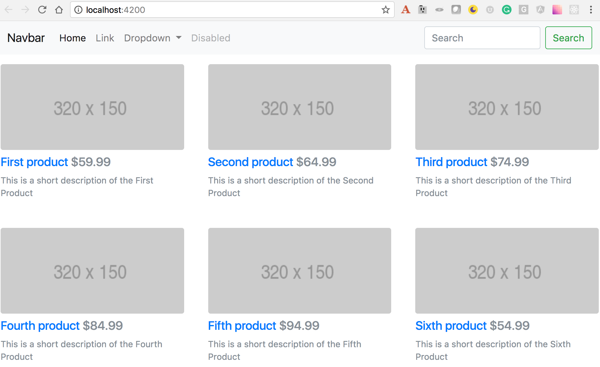
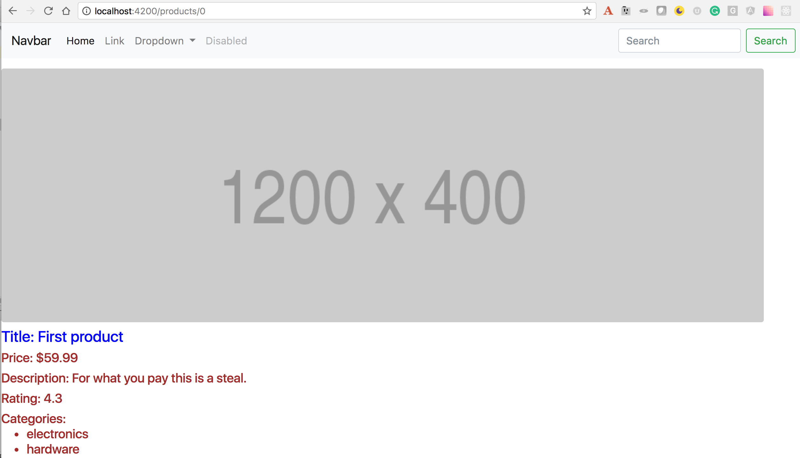

= Angular for Java Developers by Yakov Fain

:icons: font
:idprefix:
:idseparator: -
:sectanchors:
:sectlinks:
:sectnums:
:sourcedir: ../code
:source-highlighter: highlightjs

*Pre-requisites*  

1. Download and install the current version of Node.js from https://nodejs.org

2. Install Angular CLI by running the following command:
[source, sh]

----
npm install @angular/cli -g
----

In this tutorial we'll use Angular 5 and Angular CLI 1.5.0 (to check the version: `ng -v`).

NOTE: The instructions in this file are written for Java developers who are familiar with Spring Boot, have Java 8 installed and know how run a Java app from an IDE or using Maven.

== Starting the Java Spring Boot server

The code of the Spring Boot server that serves that product data is located in the directory server. This app starts on port 8080 and serves the data in a JSON format. Start this server either as a Java app in your IDE, or by running `mvn spring-boot:run`.

To see the data about all products, start the app and enter the following URL in the browser: http://localhost:8080/api/products. To see the data about a single product, specify its ID (from 0 to 5), e.g. http://localhost:8080/api/products/0.

== The myStore app (the Angular client)

Let's develop the front end of myStore where users can see featured products and view details of the selected product. The landing page of this app will look like this:

When the user clicks on the product title, the product details view is rendered

=== Initial Angular project setup

We’ll start with generating a new Angular CLI project. After that, will create the home and product detail views by creating additional Angular components, and will create a service to fetch the products info.

Generate a new myStore project:

`ng new myStore`

Open the myStore directory in your IDE.

In the myStore app, we’ll use the Bootstrap 4 framework for styling. Because Bootstrap depends on jQuery, we'll install Bootstrap and its dependencies (jQuery and popper.js) as well.

Open the integrated Terminal window in your IDE and install Bootstrap 4 Beta and its dependencies:

[source, sh]
----
npm i bootstrap@next jquery popper.js --save-prod
----

Add Bootstrap styles to the `styles` section in .angular-cli.json so it looks as follows:

[source]
----
"styles": [
  "styles.css",
  "../node_modules/bootstrap/dist/css/bootstrap.min.css"
],
---- 

Add the required scripts for Bootstrap, and jQuery by modifying the section `scripts` in .angular-cli.json to look as follows:

[source]
----
"scripts": [
  "../node_modules/jquery/dist/jquery.min.js",
  "../node_modules/popper.js/dist/umd/popper.min.js",
  "../node_modules/bootstrap/dist/js/bootstrap.min.js"
],
----

Build the app and open it in the browser at localhost:4200:

[source, sh]
----
ng serve -o
----

=== Generating components and a service for myStore

Our app will be consist of several components, e.g. Home, Footer, Navbar, etc. Our project already has the app.component, and now we'll generate more components using the Angular CLI's command `ng generate component` (or `ng g c`). To generate components without test files, open another Terminal window and run the following commands:

[source]
----
ng g c home -spec false
ng g c navbar -spec false
ng g c product-item -spec false
ng g c product-detail -spec false
----

Each of the above components is generated in a separate folder. Open the file app.module.ts - Angular CLI has added required import statements and declared all of the above components there.

Using the command `ng g s` generate the product service that will provide the data to some of the above components. Since we'll use this service in more than one component, we'll generate it in the shared dir. Specify the `-m` option so it'll add `ProductService` the `providers` property in `@NgModule` the app.module.ts:

[source]
----
ng g s shared/product -spec false -m app.module 
----

To navigate to the product detail view we'll be using Angular router. Add the following import statement to the app.module.ts:

[source]
----
import {RouterModule} from '@angular/router';
----

Add the routes configuration to the `imports` section of `@NgModule`:

[source]
----
RouterModule.forRoot([
  {path: '',                    component: HomeComponent},
  {path: 'products/:productId', component: ProductDetailComponent}
]),
----

Our root module is configured. Let's implement components and a service.

=== Application component

The generated application component is the root component of myStore and it serves as a host for all other components. The component’s source code consists of four files with the following extensions: .ts, .html, .css, and .spec.ts. 

Replace the content of app.component.html to include the Navbar, Search, Footer, and the router outlet:

[source]
----
<app-navbar></app-navbar>
<router-outlet></router-outlet>
----

=== Navbar component

Replace the content of the navbar.component.html with a sample Bootstrap Navbar borrowed from https://getbootstrap.com/docs/4.0/components/navbar:

[source]
----
<nav class="navbar navbar-expand-lg navbar-light bg-light">
  <a class="navbar-brand" href="#">Navbar</a>
  <button class="navbar-toggler" type="button" data-toggle="collapse" data-target="#navbarSupportedContent" aria-controls="navbarSupportedContent" aria-expanded="false" aria-label="Toggle navigation">
    
  </button>

  

    <ul class="navbar-nav mr-auto">
      <li class="nav-item active">
        <a class="nav-link" href="#">Home (current)</a>
      </li>
      <li class="nav-item">
        <a class="nav-link" href="#">Link</a>
      </li>
      <li class="nav-item dropdown">
        <a class="nav-link dropdown-toggle" href="#" id="navbarDropdown" role="button" data-toggle="dropdown" aria-haspopup="true" aria-expanded="false">
          Dropdown
        </a>
        

          <a class="dropdown-item" href="#">Action</a>
          <a class="dropdown-item" href="#">Another action</a>
          

          <a class="dropdown-item" href="#">Something else here</a>
        

      </li>
      <li class="nav-item">
        <a class="nav-link disabled" href="#">Disabled</a>
      </li>
    </ul>
    <form class="form-inline my-2 my-lg-0">
      <input class="form-control mr-sm-2" type="search" placeholder="Search" aria-label="Search">
      <button class="btn btn-outline-success my-2 my-sm-0" type="submit">Search</button>
    </form>
  

</nav>
----

The browser shows the window with a light grey Navbar on top.  

=== Product service

The product service will be responsible for service product data. In the shared directory, let's create a file product.ts defining the `Product` type:

[source, js]
----
export interface Product {
  id: number;
  title: string;
  price: number;
  rating: number;
  shortDescription: string;
  description: string;
  categories: string[];
}
----

The file product.service.ts will contain a class `ProductService` with methods `getProducts()` and `getProductById()` that will make HTTP requests to the server running on the local host as described in the beginning of this tutorial.
The provider for `ProductService` is already declared in `AppModule`. This service will be injected into `HomeComponent` and `ProductDetailComponent`.

Replace the code of product.service.ts with the following:

[source, js]
----
import { Injectable } from '@angular/core';
import {HttpClient} from '@angular/common/http';
import {Product} from './product';

@Injectable()
export class ProductService {

  constructor(private httpClient: HttpClient) { }

  // I'm subscribing inside the method to simplify the demo
  // A better solution is to return an observable and subscribe in the component
  getProducts(): Product[]{

    const products: Product[] = [];

    this.httpClient.get<Product[]>("/api/products")
      .subscribe(
        data => products.push(...data),
        err => console.log(err)
      );

    return products;
  }

  getProductById(productId: number): Product {

    let product:Product =<any>{};

    this.httpClient.get<Product>(`/api/products/${productId}`)
      .subscribe(
        data => Object.assign(product, data),
        err => console.log(err)
      );

    return product;
  }
}
----

Since we're planning to use `HttpClient`, we need to add `HttpClientModule` to app.module.ts:

[source, js]
----
...
import {HttpClientModule} from '@angular/common/http';

@NgModule({
   ...
  imports: [
    ...
    HttpClientModule
  ]
  ...
export class AppModule { }
----

We'll use `ProductService` to retrieve data in `HomeComponent`, which will render them as a bunch of `ProductItemComponent`.

=== Product item component

`ProductItemComponent` will know how to render one product that's passed by its parent via the `@Input()` property `product`. Modify the file product-item.component.ts to look like this:

[source]
----
import {Component, Input} from '@angular/core';
import {Product} from '../shared/product';

@Component({
  selector: 'app-product-item',
  templateUrl: './product-item.component.html',
  styleUrls: ['./product-item.component.css']
})
export class ProductItemComponent {

  @Input() product: Product;
}
----  

We'll use HTML 5 `<figure>`, `<figcaption>` and Bootstrap styles in the file product-item.component.html. Change its content to the following:

[source]
----
<figure class="figure">
  
  <figcaption class="figure-caption">
    <h5><a [routerLink]="['/products', product.id]">{{product.title}}</a>
        {{product.price | currency}}
    </h5>
    
{{product.shortDescription}}

  </figcaption>
</figure>
----

To add some margins around the `<figure>` element, let's add styles to product-item.component.css:

[source, css]
----
figure {
  margin-top: 1em;
  margin-bottom: 1em;
  margin-left: 5px;
  margin-right: 5px;
}
----

=== Home component

By default, the home component will occupy the router outlet area and will render several featured product items. Modify the content of home.component.ts to look like this:

[source]
----
import {Component, OnInit} from '@angular/core';
import {Product} from '../shared/product';
import {ProductService} from '../shared/product.service';

@Component({
  selector: 'app-home',
  templateUrl: './home.component.html',
  styleUrls: ['./home.component.css']
})
export class HomeComponent implements OnInit {

  products: Product[]=[];
  constructor(private productService: ProductService) { }

  ngOnInit() {
    this.products = this.productService.getProducts();
  }
}
----

Angular invokes the lifecycle method `ngOnInit()` after the instance of a component is created. We populate the `products` array there. 

Replace the content of home.component.html to loop through the array `products` with `*ngFor` and render each product:

[source]
----

  

    <app-product-item [product]="product"></app-product-item>
  

----

Each product will be represented by the same HTML template. The `*ngFor` directive iterates through the `products` array rendering HTML template for each element. 

Because `*ngFor` is inside `
`, each loop iteration will render a `
` with the content of the corresponding `<app-product-item>` inside. To pass an instance of a product to `ProductComponent`, you use the square brackets for property binding: `[product]="prod"`, where `[product]` refers to the property named `product` inside the `<app-product-item>` component, and `product` is a local template variable declared on the fly in the `*ngFor` directive as `let product`. 

NOTE: The styles `col-sm-4 col-lg-4 col-md-4` come from the Bootstrap framework where the viewport’s width is divided into 12 invisible columns. In this example we want to allocate 4 columns (one third of the `
`’s width) if a device has small (`sm` means 768px or more), large (`lg` is for 1200px or more), and medium (`md` is for 992px or more) screen sizes. You can read more about the Bootstrap grid system at http://getbootstrap.com/css/#grid.

We keep running the Angualar app on port 4200 using the dev server that comes with Angular CLI. The `ProductSevice` will try to hit the REST endpoints like `/api/products`, but they're not there and *we'll get 404*. The data are provided by the server running on port 8080. Let's configure a proxy.

=== Configuring a proxy 

In the root of your Angular project create the file proxy-conf.json with the following content:

[source, json]
----
{
  "/api": {
    "target": "http://localhost:8080",
    "secure": false
  }
}
----

Restart the Angular app by running the following command:

[source, sh]
----
ng serve --proxy-config proxy-conf.json
----
Now the dev server will redirect all HTTP request that have `/api` in the URL to the server that runs on port 8080 and your app should look like this:

=== Product detail component

The `ProductDetailComponent` is rendered in the router outlet area when the user clicks on the title in the `ProductItemComponent`.

The `ProductDetailComponent` receives the product ID from the parent (via `ActivatedRoute`), and then makes requests to `ProductService` to retrieve the details of the selected product.

Modify the code in product-detail.component.ts to look as follows:

[source]
----
import {Component, OnInit} from '@angular/core';
import {ProductService} from '..//shared/product.service';
import {Product} from '..//shared/product';
import {ActivatedRoute} from '@angular/router';

@Component({
  selector: 'app-product-detail',
  templateUrl: './product-detail.component.html',
  styleUrls: ['./product-detail.component.css']
})
export class ProductDetailComponent implements OnInit {

  product: Product;

  constructor(private route: ActivatedRoute, private productService: ProductService) {}

  ngOnInit() {
    let prodId: number = parseInt(this.route.snapshot.params['productId']);
    this.product = this.productService.getProductById(prodId);
  }
}
----

The product detail template will render the product image (i.e. a large gray rectangle) with product details.  

Modify the content of product-detail.component.html to look like this:

[source]
----
<figure class="figure">
  
  <figcaption class="figure-caption">
    <h4>Title: {{product.title}}</h4>
    <h5>Price: {{product.price | currency}}</h5>
    <h5> Description: {{product.description}}</h5>
    <h5> Rating: {{product.rating}}</h5>
    <h5>Categories:
    <ul>
    <li *ngFor="let category of product.categories">
      {{category}}
    </li>
    </ul></h5>
  </figcaption>
</figure>
----

Add a margin and colors in product-detail.component.css:

[source, css]
----
figure {
  margin-top: 1em;
}

h4 {
  color: blue;
}

h5 {
  color: brown;
}
----

On the home page, click on the title of a product and you'll see its details, for example:

=== Deploying in Spring Boot (if time permits)

Install packages for removing files/dirs (rimraf), copying files (copyfiles), and creating new dirs (mkdirp):

[source, sh]
----
npm i rimraf copyfiles mkdirp --save-dev
----

Add the following commands to the scripts section in package.json:

[source, sh]
----
"buildprod": "ng build --prod",
"postbuildprod": "npm run deploy",
"predeploy": "rimraf .../server/src/main/resources/static && mkdirp ../server/src/main/resources/static",
"deploy": "copyfiles -f dist/** ../server/src/main/resources/static",
----

Run the deployment scripts:

[source, sh]
----
npm run buildprod
----

In your browser go to the Spring Boot URL: http://localhost:8080. The myStoreApp is rendered by the Spring Boot server.

*The end!*

P.S. I'm bloging on Angular-related topics at https://yakovfain.com.