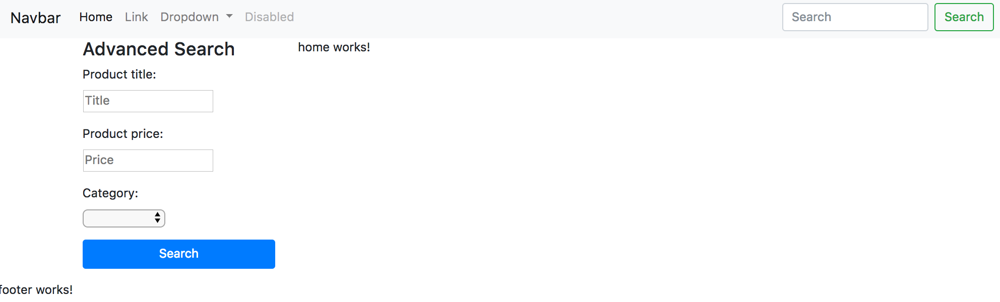
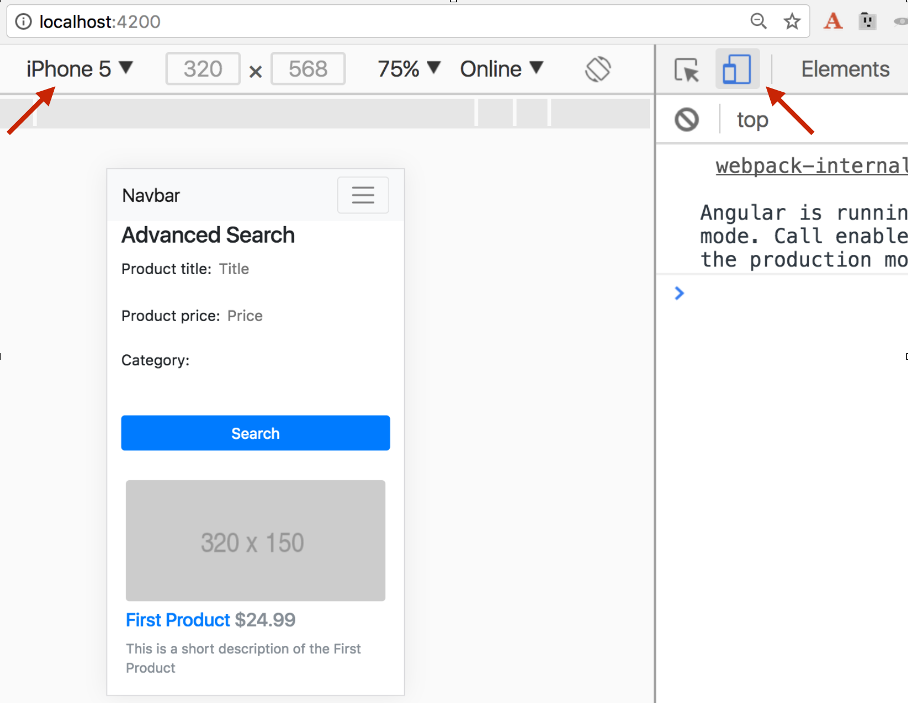

= Angular Applied by Yakov Fain

:icons: font
:idprefix:
:idseparator: -
:sectanchors:
:sectlinks:
:sectnums:
:sourcedir: ../code
:source-highlighter: highlightjs

*Pre-requisites*  

1. Download and install the current version of Node.js from https://nodejs.org

2. Install Angular CLI by running the following command:
[source, sh]

----
npm install @angular/cli -g
----

Check your version of Angular CLI (`ng -v`). It has to be 1.5.0 or later.

== The myStore app 

Let's use Angular 5 to develop a myStore app where users can see featured  products and view details of the selected product. The landing page of this app will look like this:

image::images/home1.png[]

When the user clicks on the product title, the product details view is rendered

image::images/product_detail.png[]

NOTE: The product data for this app will be hard-coded in the class `ProductService` so you won't need any external server supplying data. If you want to create an Angular app that will get the data from a Java Spring server, following the instructions from the file myStore_instructions_spring_server.html.

=== Initial project setup

We’ll start with generating a new Angular CLI project. After that, will create the home and product detail views by creating additional Angular components, and will create a service to fetch the products info.

Generate a new myStore project:

`ng new myStore`

Go to the directory myStore and start the app:

[source]
----
cd myStore
ng serve -o
----

Your browser shows the generated app with Anguar logo and three links.

Stop the dev server (Ctrl-C).

Open the myStore directory in your IDE.

In the myStore app, we’ll use the Bootstrap 4 framework for styling. Let's install Bootstrap and its dependencies (jQuery and popper.js). Open the integrated Terminal window in your IDE and run the following command:

[source, sh]
----
npm i bootstrap@next jquery popper.js -P
----

Add Bootstrap styles to the `styles` section in .angular-cli.json so it looks as follows:

[source]
----
"styles": [
  "styles.css",
  "../node_modules/bootstrap/dist/css/bootstrap.css"
],
---- 

Add the required scripts for Bootstrap, and jQuery by modifying the section `scripts` in .angular-cli.json to look as follows:

[source]
----
"scripts": [
  "../node_modules/jquery/dist/jquery.js",
  "../node_modules/popper.js/dist/umd/popper.js",
  "../node_modules/bootstrap/dist/js/bootstrap.js"
],
----

Build the app and open it in the browser at localhost:4200:

[source, sh]
----
ng serve -o
----

The app looks the same as before.

=== Adding components, service, and routes

Our app will be consist of several components, e.g. App, Home, Footer, Navbar, etc. The App component has been generated already, and now we'll generate more components using the Angular CLI's command `ng generate component` (or `ng g c`). Open *another Terminal window* and run the following commands:

[source]
----
ng g c home -spec false
ng g c footer -spec false
ng g c navbar -spec false
ng g c product-item -spec false
ng g c product-detail -spec false
ng g c search -spec false
----

Each of the above components is generated in a separate folder. Open the file app.module.ts - Angular CLI has added required import statements and declared all of the above components there.

NOTE: Angular CLI 1.5.0 has a bug and you need to manually update  the first line in the generated .ts files of the components to look like this:

[source, js]
----
import {Component, OnInit, ViewEncapsulation} from '@angular/core';
----

Using the command `ng g s` generate the product service that will provide the data to some of the above components. Since we'll use this service in more than one component, we'll generate it in the shared dir. Specify the `-m` option so it'll add `ProductService` the `providers` property in `@NgModule` the app.module.ts:

[source]
----
ng g s shared/product -spec false -m app.module 
----

To navigate to the product detail view we'll be using Angular router. Add the following import statement to the app.module.ts:

[source]
----
import {RouterModule} from '@angular/router';
----

Add the routes configuration to the `imports` section of `@NgModule`:

[source]
----
  imports: [
    RouterModule.forRoot([
      {path: '',                    component: HomeComponent},
      {path: 'products/:productId', component: ProductDetailComponent}
    ]),
    ...
]

----

Our root module is configured, but the running app looks the same. Let's use/modify the generated components and a service.

=== Application component

The generated application component is the root component of myStore and it serves as a host for all other components. The component’s source code consists of four files with the following extensions: .ts, .html, .css, and .spec.ts. 

Replace the content of app.component.html to include the Navbar, Search, Footer, and the router outlet (we use the Bootstrap CSS classes):

[source]
----
<app-navbar></app-navbar>

  

    

      <app-search></app-search>
    

    

      <router-outlet></router-outlet>
    

  

<app-footer></app-footer>
----

Run the app with `ng serve -o` and you'll see the following:

image::images/initial_look.png[]

Enjoy the initial version of myStore!

NOTE: If you don't see the above window, open the browser's console - it should have reported some errors.

=== Navbar component

Replace the content of the navbar.component.html with a sample Bootstrap Navbar borrowed from https://getbootstrap.com/docs/4.0/components/navbar:

[source]
----
<nav class="navbar navbar-expand-lg navbar-light bg-light">
  <a class="navbar-brand" href="#">Navbar</a>
  <button class="navbar-toggler" type="button" data-toggle="collapse" data-target="#navbarSupportedContent" aria-controls="navbarSupportedContent" aria-expanded="false" aria-label="Toggle navigation">
    
  </button>

  

    <ul class="navbar-nav mr-auto">
      <li class="nav-item active">
        <a class="nav-link" href="#">Home (current)</a>
      </li>
      <li class="nav-item">
        <a class="nav-link" href="#">Link</a>
      </li>
      <li class="nav-item dropdown">
        <a class="nav-link dropdown-toggle" href="#" id="navbarDropdown" role="button" data-toggle="dropdown" aria-haspopup="true" aria-expanded="false">
          Dropdown
        </a>
        

          <a class="dropdown-item" href="#">Action</a>
          <a class="dropdown-item" href="#">Another action</a>
          

          <a class="dropdown-item" href="#">Something else here</a>
        

      </li>
      <li class="nav-item">
        <a class="nav-link disabled" href="#">Disabled</a>
      </li>
    </ul>
    <form class="form-inline my-2 my-lg-0">
      <input class="form-control mr-sm-2" type="search" placeholder="Search" aria-label="Search">
      <button class="btn btn-outline-success my-2 my-sm-0" type="submit">Search</button>
    </form>
  

</nav>
----

The browser shows the window with a ligh grey Navbar on top: 

image::images/toolbar.png[]

TIP: Make the window width smaller and see how the toolbar and page layout changes.  

=== Advanced search component 

Replace the content of the search.component.html with this:

[source]
----
<h4>Advanced Search</h4>
<form #f="ngForm">
  

    <label for="title">Product title:</label>
    <input id="title"
           placeholder="Title" type="text"
           name="title" ngModel>
  

  

    <label for="price">Product price:</label>
    <input id="price"
           placeholder="Price" type="number"
           name="price" ngModel>
  

  

    <label for="category">Category:</label> 
    <select id="category"
            placeholder="Category"
            name="category" ngModel>
      <option>books</option>
      <option>electronics</option>
      <option>hardware</option>
    </select>
  

  

    <button type="submit"
            class="btn btn-primary btn-block">Search</button>
  

</form>
----

The browser stopped rendering the app. Its console shows an error - it doesn't know about `ngForm`, which is a part of Angular Forms API. Add the `FormsModule` to the `imports` section of app.module.ts:

[source, js]
----
import {FormsModule} from "@angular/forms";

@NgModule({
  ... 
  imports: [
    FormsModule,
   ... 
----

The app looks like this now:

=== Footer component

Replace the content of the footer.component.html with this:

[source]
----

  

  <footer>
    

      

        
Copyright &copy; My Store 2017

      

    

  </footer>

----

=== Product service

The product service will be responsible for service product data. In the shared directory, let's create a file product.ts defining the `Product` type:

[source, js]
----
export interface Product {
    id: number;
    title: string;
    price: number;
    rating: number;
    shortDescription: string;
    description: string;
    categories: string[];
}
----

The file product.service.ts will contain a class `ProductService` with methods `getProducts()` and `getProductById()`, and an array with hard-coded products
The provider for `ProductService` is already declared in `AppModule`. This service will be injected into `HomeComponent` and `ProductDetailComponent`.

Replace the code of product.service.ts with the following:

[source, js]
----
import {Injectable} from '@angular/core';
import {Product} from './product';

@Injectable()
export class ProductService {

  getProducts(): Product[] {
    return products;
  }

  getProductById(productId: number): Product {
    return products.find(p => p.id === productId);
  }
}

const products = [
  {
    "id": 0,
    "title": "First Product",
    "price": 24.99,
    "rating": 4.3,
    "shortDescription": "This is a short description of the First Product",
    "description": "Lorem ipsum dolor sit amet, consectetur adipiscing elit.",
    "categories": ["electronics", "hardware"]
  },
  {
    "id": 1,
    "title": "Second Product",
    "price": 64.99,
    "rating": 3.5,
    "shortDescription": "This is a short description of the Second Product",
    "description": "Lorem ipsum dolor sit amet, consectetur adipiscing elit.",
    "categories": ["books"]
  },
  {
    "id": 2,
    "title": "Third Product",
    "price": 74.99,
    "rating": 4.2,
    "shortDescription": "This is a short description of the Third Product",
    "description": "Lorem ipsum dolor sit amet, consectetur adipiscing elit.",
    "categories": ["electronics"]
  },
  {
    "id": 3,
    "title": "Fourth Product",
    "price": 84.99,
    "rating": 3.9,
    "shortDescription": "This is a short description of the Fourth Product",
    "description": "Lorem ipsum dolor sit amet, consectetur adipiscing elit.",
    "categories": ["hardware"]
  },
  {
    "id": 4,
    "title": "Fifth Product",
    "price": 94.99,
    "rating": 5,
    "shortDescription": "This is a short description of the Fifth Product",
    "description": "Lorem ipsum dolor sit amet, consectetur adipiscing elit.",
    "categories": ["electronics", "hardware"]
  },
  {
    "id": 5,
    "title": "Sixth Product",
    "price": 54.99,
    "rating": 4.6,
    "shortDescription": "This is a short description of the Sixth Product",
    "description": "Lorem ipsum dolor sit amet, consectetur adipiscing elit.",
    "categories": ["books"]
  }
];
----

=== Product item component

`ProductItemComponent` will know how to render one product that's passed by its parent via the `@Input()` property `product`. Modify the file product-item.component.ts to look like this:

[source]
----
import {Component, Input} from '@angular/core';
import {Product} from '../shared/product';

@Component({
  selector: 'app-product-item',
  templateUrl: './product-item.component.html',
  styleUrls: ['./product-item.component.css']
})
export class ProductItemComponent {

  @Input() product: Product;
}
----   

We'll use HTML 5 `<figure>`, `<figcaption>` and Bootstrap styles in the file product-item.component.html. The `routerLink` directive will be used to nabigate to the product detail view. Change its content to the following:

[source]
----
<figure class="figure">
  
  <figcaption class="figure-caption">
    <h5><a [routerLink]="['/products', product.id]">{{product.title}}</a>
        {{product.price | currency}}
    </h5>
    
{{product.shortDescription}}

  </figcaption>
</figure>
----

To add some margins around the `<figure>` element, let's add styles to product-item.component.css:

[source, css]
----
figure {
  margin-top: 1em;
  margin-bottom: 1em;
  margin-left: 5px;
  margin-right: 5px;
}
----

=== Home component

By default, the home component will occupy the router outlet area and will render several featured product items. Modify the content of home.component.ts to look like this:

[source]
----
import {Component, OnInit} from '@angular/core';
import {Product} from '../shared/product';
import {ProductService} from '../shared/product.service';

@Component({
  selector: 'app-home',
  templateUrl: './home.component.html',
  styleUrls: ['./home.component.css']
})
export class HomeComponent implements OnInit {

  products: Product[]=[];
  constructor(private productService: ProductService) { }

  ngOnInit() {
    this.products = this.productService.getProducts();
  }
}
----

Angular invokes the lifecycle method `ngOnInit()` after the instance of a component is created. We populate the `products` array there. 

Replace the content of home.component.html to loop through the array `products` with `*ngFor` and render each product:

[source]
----

  

    <app-product-item [product]="product"></app-product-item>
  

----

Each product will be represented by the same HTML template. The `*ngFor` directive iterates through the `products` array rendering HTML template for each element. 

Because `*ngFor` is inside `
`, each loop iteration will render a `
` with the content of the corresponding `<app-product-item>` inside. To pass an instance of a product to `ProductItemComponent`, you use the square brackets for property binding: `[product]="prod"`, where `[product]` refers to the property named `product` inside the `<app-product-item>` component, and `product` is a local template variable declared on the fly in the `*ngFor` directive as `let product`. 

Now your app should look like this:

image::images/home1.png[]

.Bootstrap grid layout
************
The styles `col-sm-4 col-lg-4 col-md-4` come from the Bootstrap framework where the viewport’s width is divided into 12 invisible columns. We want to allocate 4 columns (one third of the `
`’s width) if a device has small width (`sm` means 576px or more), large (`lg` is for 1200px or more), and medium (`md` is for 992px or more). Since we didn't provide any layout for extra small devices (`xs` means less than 576px), the `ProductItemComponent` will take the entire width of the viewport. Read about the Bootstrap grid system at https://v4-alpha.getbootstrap.com/layout/grid/.
************

See how your app will be rendered on smaller devices by using the Toggle Device option in Google Dev Tools:

 

=== Product detail component

To navigate to the product detail view we'll use Angular router configured in section "Adding components, service, and routes".

The `ProductDetailComponent` is rendered in the router outlet area when the user clicks on the title in the `ProductItemComponent`.

The `ProductDetailComponent` receives the product ID from the parent (via `ActivatedRoute`), and then makes requests to `ProductService` to retrieve the details of the selected product.

Modify the code in product-detail.component.ts to look as follows:

[source]
----
import {Component, OnInit} from '@angular/core';
import {ProductService} from '..//shared/product.service';
import {Product} from '..//shared/product';
import {ActivatedRoute} from '@angular/router';

@Component({
  selector: 'app-product-detail',
  templateUrl: './product-detail.component.html',
  styleUrls: ['./product-detail.component.css']
})
export class ProductDetailComponent implements OnInit {

  product: Product;

  constructor(private route: ActivatedRoute, private productService: ProductService) {}

  ngOnInit() {
    let prodId: number = parseInt(this.route.snapshot.params['productId']);
    this.product = this.productService.getProductById(prodId);
  }
}
----

The product detail template will render the product image (i.e. a large gray rectangle) with product details.  

Modify the content of product-detail.component.html to look like this:

[source]
----
<figure class="figure">
  
  <figcaption class="figure-caption">
    <h4>Title: {{product.title}}</h4>
    <h5>Price: {{product.price | currency}}</h5>
    <h5> Description: {{product.description}}</h5>
    <h5> Rating: {{product.rating}}</h5>
    <h5>Categories:
    <ul>
    <li *ngFor="let category of product.categories">
      {{category}}
    </li>
    </ul></h5>
  </figcaption>
</figure>
----

Add a margin and colors in product-detail.component.css:

[source, css]
----
figure {
  margin-top: 1em;
}

h4 {
  color: blue;
}

h5 {
  color: brown;
}
----

On the home page, click on the title of a product and you'll see its details, for example:

image::images/product_detail.png[]

*The end!*

P.S. I'm blogging on Angular-related topics at https://yakovfain.com.

P.S.S. NOTE: If you want to run the version of this app that communicates with the Spring Boot server, see instructions in AngularForJavaDevs/myStore_spring_boot.html.
